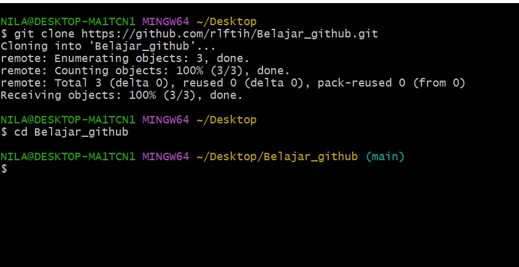
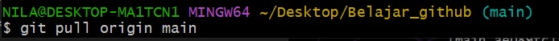

# Belajar_github

1. Pentingnya Penggunaan Command Line
Command Line sangat penting dalam penggunaan Git dan GitHub karena memudahkan pengguna untuk mengelola repository dengan cepat dan efisien. Melalui Command Line, kita dapat menjalankan berbagai perintah seperti membuat repository, menambahkan file, melakukan commit, push, pull, dan clone tanpa harus membuka aplikasi tambahan. Selain itu, penggunaan Command Line juga membantu memahami proses kerja Git secara lebih mendalam.

2. Langkah-Langkah Push Repository
Langkah pertama adalah membuka folder project melalui Command Line. Setelah itu gunakan perintah git init untuk menginisialisasi repository. Selanjutnya tambahkan file dengan perintah git add ., lalu simpan perubahan menggunakan git commit -m "pesan commit". Setelah itu hubungkan dengan repository GitHub menggunakan git remote add origin link_repository. Terakhir gunakan git push -u origin main untuk mengirim file ke GitHub.

3. Langkah-Langkah Clone Repository
Clone repository digunakan untuk menyalin repository dari GitHub ke komputer. Caranya adalah membuka Command Line, lalu ketik perintah git clone link_repository. Setelah itu tekan Enter, maka seluruh file yang ada di repository akan terunduh ke komputer dan siap digunakan atau diedit.

4. Langkah-Langkah Pull dan Push Repository
Perintah git pull digunakan untuk mengambil update terbaru dari repository GitHub ke komputer lokal agar file tetap sinkron. Setelah melakukan perubahan pada file, gunakan git add ., lalu git commit -m "update file", dan terakhir git push untuk mengirim perubahan terbaru kembali ke GitHub.
